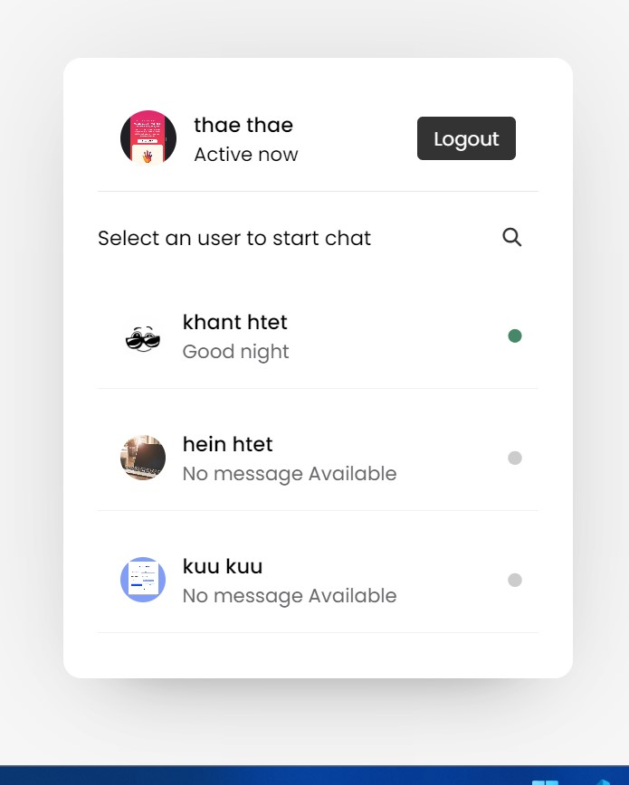
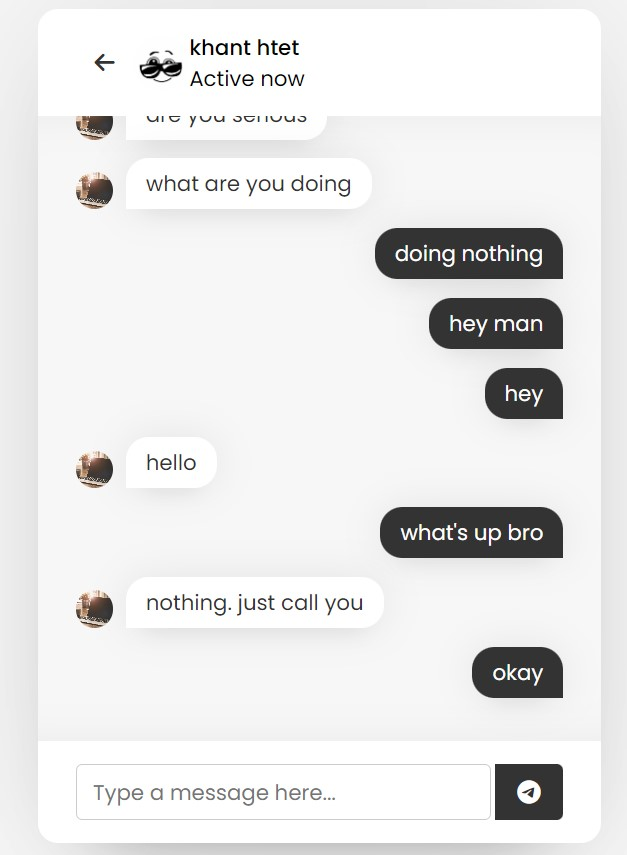

## Real Time Chat Application with PHP

In this web application, we can create user account,login, and chat with each other who use this web application.

    This is not my project, it's from Youtube!

[Here is the link (Tutorial)!](https://youtu.be/VnvzxGWiK54)

My First PHP Project [TodoList.](https://github.com/Hein-HtetSan/todoList)

Languages: `html` | `css` | `JavaScript` | `PHP` | `Ajax` | `MySql`

- Just learnt a lot from this project and also willing to thank to Youtube instructor.
- Just knew how to code effectively. How to write code fast and so on.
- How to think and how to design it.

### Project SnapShot

___
